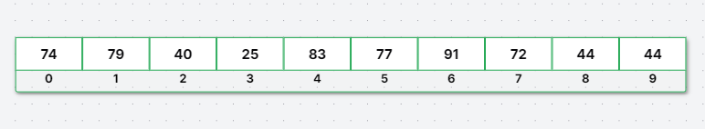
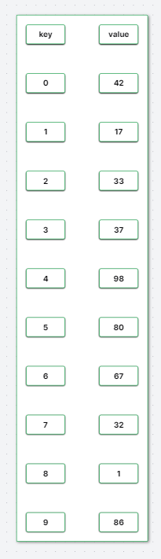
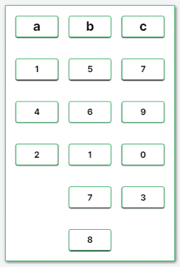
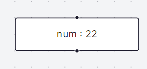
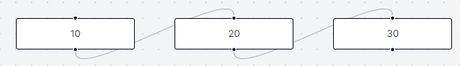
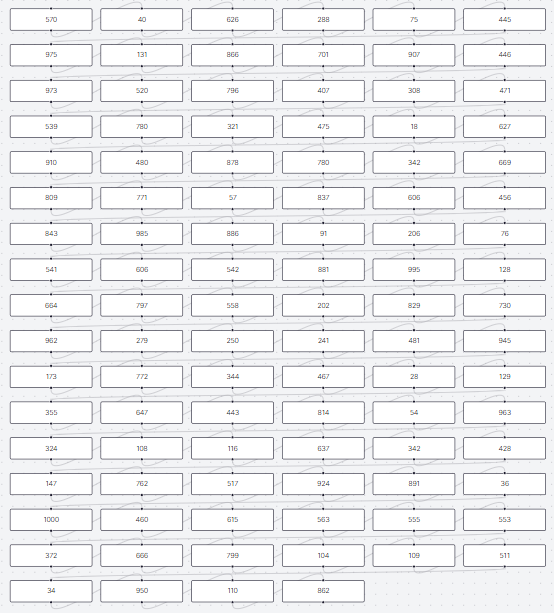
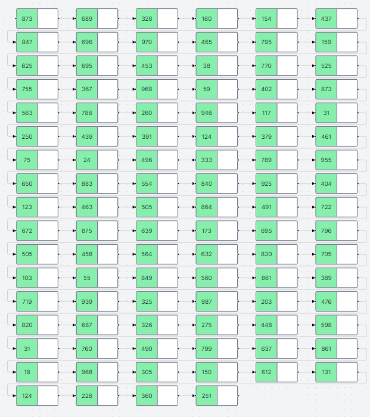

# [Fun & Mental](https://fundamental-iota.vercel.app/): Visualizing Data Structures and Algorithms with React Flow and Monaco Editor


Welcome to **[Fun & Mental](https://fundamental-iota.vercel.app/)**, an innovative project that brings data structures and algorithms to life through interactive visualizations. This project, currently under development, leverages the power of React Flow and Monaco Editor to allow users to create, visualize, and understand complex data structures and algorithms in a fun and intuitive way.

## Key Features

1. **Interactive Visualizations**: Use React Flow to create dynamic nodes and edges representing various data structures and algorithms.
2. **Code in TSX**: Write and visualize your code directly in TSX files using the Monaco Editor.
3. **Customizable Components**: Design your own data structures, nodes, and edges with ease.
4. **Integrated Layout Management**: Utilize ELK library for efficient and customizable layout management.
5. **Ready-to-Use Data Structures**: Access pre-built data structures like
   - **Binary Search Trees**
     - 
   - **Stacks**
     - 
   - **Vectors**,
     - 
   - **HashMaps**
     - 
   - **Tables**.
     - 
   - **Element**
     - 
6. **LeetCode Problem Visualizations**: Visualize solutions to various LeetCode problems, with plans to cover all Neetcode problems.

### Getting Started

### Example Code

Here's a quick example to get you started with visualizing a Binary Search Tree:

```tsx
let frame = [];
let wait = 0.3;

function main() {
  const bst = new BinarySearchTree<number>();

  for (let i = 0; i < 30; i++) {
    const num = Math.round(Math.random() * 100);
    bst.insert(num);
    frame.push([Util.deepCopy(bst)]);
  }

  return { frame, wait };
}
```


In this example:

- `frame` is an array that stores each state of the binary search tree.
- `wait` sets the wait time between each render.
- `Util.deepCopy` is used to get a deep copy of the object.

link to this example <https://fundamental-iota.vercel.app/algorithm/2>

## Creating Custom Visualization Using Playground

### Step 1: Simple Linked List Class

First, let's create a basic linked list class without implementing the `IReactFlow` interface. This class will allow us to add and remove elements from the linked list.

```tsx
class LinkedList<T> {
  private list: T[];

  constructor() {
    this.list = [];
  }

  push_back(ele: T) {
    this.list.push(ele);
  }

  pop_back() {
    return this.list.pop();
  }

  size() {
    return this.list.length;
  }
}
```

[Link to this example](<https://fundamental-iota.vercel.app/playground?code=class%20LinkedList%3CT%3E%20%7B%0A%20%20%20%20private%20list%3A%20T%5B%5D%3B%0A%0A%20%20%20%20constructor()%20%7B%0A%20%20%20%20%20%20%20%20this.list%20%3D%20%5B%5D%3B%0A%20%20%20%20%7D%0A%0A%20%20%20%20push_back(ele%3A%20T)%20%7B%0A%20%20%20%20%20%20%20%20this.list.push(ele)%3B%0A%20%20%20%20%7D%0A%0A%20%20%20%20pop_back()%20%7B%0A%20%20%20%20%20%20%20%20return%20this.list.pop()%3B%0A%20%20%20%20%7D%0A%0A%20%20%20%20size()%20%7B%0A%20%20%20%20%20%20%20%20return%20this.list.length%3B%0A%20%20%20%20%7D%0A%7D%0A%0Afunction%20main()%7B%0A%20%20%20%20const%20ll%20%3D%20new%20LinkedList%3Cnumber%3E()%3B%0A%20%20%20%20ll.push_back(10)%3B%0A%20%20%20%20ll.push_back(20)%3B%0A%20%20%20%20ll.push_back(30)%3B%0A%20%20%20%20ll.push_back(40)%3B%0A%20%20%20%20console.log(ll.pop_back())%3B%0A%20%20%20%20console.log(ll.size())%3B%0A%0A%7D>)

### Step 2: Visualizing Linked List with React Flow

Next, we will implement the method in the `IReactFlow` interface that generates React Flow elements (nodes and edges) for visualizing the linked list. We'll use the default node and edge types provided by React Flow.

[React Flow Documentation](https://reactflow.dev/)

```tsx
class LinkedList<T> implements IReactFlow {
  // ... (previous code)

  // create react flow elements
  getReactFlowElements() {
    const elements = {
      nodes: [],
      edges: [],
    };

    if (this.list.length === 0) return Promise.resolve(elements);

    // to see all node props <https://reactflow.dev/api-reference/types/node-props>
    elements.nodes.push({
      id: `node-0`,
      type: "default",
      position: { x: 0, y: 0 },
      data: { label: this.list[0] },
    });

    let preNodeId = `node-0`;

    for (let i = 1; i < this.list.length; i++) {
      const node = {
        id: `node-${i}`,
        type: "default",
        position: { x: i * 200, y: 0 },
        data: { label: this.list[i] },
      };
      elements.nodes.push(node);
      // to see all edge props <https://reactflow.dev/api-reference/types/edge-props>
      const edge = {
        id: `edge-${i}`,
        source: preNodeId,
        target: `node-${i}`,
        type: "default",
      };

      elements.edges.push(edge);
      preNodeId = `node-${i}`;
    }

    return Promise.resolve(elements);
  }
}
```



[Full example](<https://fundamental-iota.vercel.app/playground?code=class%20LinkedList%3CT%3E%20implements%20IReactFlow%20%7B%0A%20%20%20%20private%20list%3A%20T%5B%5D%3B%0A%0A%20%20%20%20constructor()%20%7B%0A%20%20%20%20%20%20%20%20this.list%20%3D%20%5B%5D%3B%0A%20%20%20%20%7D%0A%0A%20%20%20%20push_back(ele%3A%20T)%20%7B%0A%20%20%20%20%20%20%20%20this.list.push(ele)%3B%0A%20%20%20%20%7D%0A%0A%20%20%20%20pop_back()%20%7B%0A%20%20%20%20%20%20%20%20return%20this.list.pop()%3B%0A%20%20%20%20%7D%0A%0A%20%20%20%20size()%20%7B%0A%20%20%20%20%20%20%20%20return%20this.list.length%3B%0A%20%20%20%20%7D%0A%20%20%20%20getReactFlowElements()%20%7B%0A%20%20%20%20%20%20%20%20const%20elements%20%3D%20%7B%0A%20%20%20%20%20%20%20%20%20%20%20%20nodes%3A%20%5B%5D%2C%0A%20%20%20%20%20%20%20%20%20%20%20%20edges%3A%20%5B%5D%2C%0A%20%20%20%20%20%20%20%20%7D%3B%0A%0A%20%20%20%20%20%20%20%20if%20(this.list.length%20%3D%3D%3D%200)%20return%20Promise.resolve(elements)%3B%0A%0A%20%20%20%20%20%20%20%20%2F%2F%20to%20see%20all%20node%20props%20https%3A%2F%2Freactflow.dev%2Fapi-reference%2Ftypes%2Fnode-props%0A%20%20%20%20%20%20%20%20elements.nodes.push(%7B%0A%20%20%20%20%20%20%20%20%20%20%20%20id%3A%20%60node-0%60%2C%0A%20%20%20%20%20%20%20%20%20%20%20%20type%3A%20%22default%22%2C%0A%20%20%20%20%20%20%20%20%20%20%20%20position%3A%20%7B%20x%3A%200%2C%20y%3A%200%20%7D%2C%0A%20%20%20%20%20%20%20%20%20%20%20%20data%3A%20%7B%20label%3A%20this.list%5B0%5D%20%7D%2C%0A%20%20%20%20%20%20%20%20%7D)%3B%0A%0A%20%20%20%20%20%20%20%20let%20preNodeId%20%3D%20%60node-0%60%3B%0A%0A%20%20%20%20%20%20%20%20for%20(let%20i%20%3D%201%3B%20i%20%3C%20this.list.length%3B%20i%2B%2B)%20%7B%0A%20%20%20%20%20%20%20%20%20%20%20%20const%20node%20%3D%20%7B%0A%20%20%20%20%20%20%20%20%20%20%20%20%20%20%20%20id%3A%20%60node-%24%7Bi%7D%60%2C%0A%20%20%20%20%20%20%20%20%20%20%20%20%20%20%20%20type%3A%20%22default%22%2C%0A%20%20%20%20%20%20%20%20%20%20%20%20%20%20%20%20position%3A%20%7B%20x%3A%20i%20*%20200%2C%20y%3A%200%20%7D%2C%0A%20%20%20%20%20%20%20%20%20%20%20%20%20%20%20%20data%3A%20%7B%20label%3A%20this.list%5Bi%5D%20%7D%2C%0A%20%20%20%20%20%20%20%20%20%20%20%20%7D%3B%0A%20%20%20%20%20%20%20%20%20%20%20%20elements.nodes.push(node)%3B%0A%20%20%20%20%20%20%20%20%20%20%20%20%2F%2F%20to%20see%20all%20edge%20props%20https%3A%2F%2Freactflow.dev%2Fapi-reference%2Ftypes%2Fedge-props%0A%20%20%20%20%20%20%20%20%20%20%20%20const%20edge%20%3D%20%7B%0A%20%20%20%20%20%20%20%20%20%20%20%20%20%20%20%20id%3A%20%60edge-%24%7Bi%7D%60%2C%0A%20%20%20%20%20%20%20%20%20%20%20%20%20%20%20%20source%3A%20preNodeId%2C%0A%20%20%20%20%20%20%20%20%20%20%20%20%20%20%20%20target%3A%20%60node-%24%7Bi%7D%60%2C%0A%20%20%20%20%20%20%20%20%20%20%20%20%20%20%20%20type%3A%20%22default%22%2C%0A%20%20%20%20%20%20%20%20%20%20%20%20%7D%3B%0A%0A%20%20%20%20%20%20%20%20%20%20%20%20elements.edges.push(edge)%3B%0A%20%20%20%20%20%20%20%20%20%20%20%20preNodeId%20%3D%20%60node-%24%7Bi%7D%60%3B%0A%20%20%20%20%20%20%20%20%7D%0A%0A%20%20%20%20%20%20%20%20return%20Promise.resolve(elements)%3B%0A%20%20%20%20%7D%0A%7D%0A%0Alet%20frame%20%3D%20%5B%5D%3B%0A%0Afunction%20main()%20%7B%0A%20%20%20%20const%20ll%20%3D%20new%20LinkedList%3Cnumber%3E()%3B%0A%20%20%20%20ll.push_back(10)%3B%0A%20%20%20%20ll.push_back(20)%3B%0A%20%20%20%20ll.push_back(30)%3B%0A%20%20%20%20ll.push_back(40)%3B%0A%20%20%20%20console.log(ll.pop_back())%3B%0A%20%20%20%20console.log(ll.size())%3B%0A%0A%20%20%20%20frame.push(%5Bll%5D)%3B%0A%20%20%20%20return%20%7B%20frame%20%7D%0A%7D>)

### Step 3: Using ELK Library for Layout

We can use the ELK library to handle the layout.

```tsx
class LinkedList<T> implements IReactFlow {
  // ... (previous code)

  // create react flow elements
  getReactFlowElements() {
    const elements = {
      nodes: [],
      edges: [],
    };

    if (this.list.length === 0) return Promise.resolve(elements);

    // to see all node props <https://reactflow.dev/api-reference/types/node-props>
    elements.nodes.push({
      id: `node-0`,
      type: "default",
      data: { label: this.list[0] },
    });

    let preNodeId = `node-0`;

    for (let i = 1; i < this.list.length; i++) {
      const node = {
        id: `node-${i}`,
        type: "default",
        data: { label: this.list[i] },
      };
      elements.nodes.push(node);
      // to see all edge props <https://reactflow.dev/api-reference/types/edge-props>
      const edge = {
        id: `edge-${i}`,
        source: preNodeId,
        target: `node-${i}`,
        type: "default",
      };

      elements.edges.push(edge);
      preNodeId = `node-${i}`;
    }

    // getLayoutElements takes the nodes, edges, and ELK options
    return getLayoutElements(elements.nodes, elements.edges, {
      "elk.algorithm": "box",
    });
  }
}
```



[Full example](<https://fundamental-iota.vercel.app/playground?code=class%20LinkedList%3CT%3E%20implements%20IReactFlow%20%7B%0A%20%20%20%20private%20list%3A%20T%5B%5D%3B%0A%0A%20%20%20%20constructor()%20%7B%0A%20%20%20%20%20%20%20%20this.list%20%3D%20%5B%5D%3B%0A%20%20%20%20%7D%0A%0A%20%20%20%20push_back(ele%3A%20T)%20%7B%0A%20%20%20%20%20%20%20%20this.list.push(ele)%3B%0A%20%20%20%20%7D%0A%0A%20%20%20%20pop_back()%20%7B%0A%20%20%20%20%20%20%20%20return%20this.list.pop()%3B%0A%20%20%20%20%7D%0A%0A%20%20%20%20size()%20%7B%0A%20%20%20%20%20%20%20%20return%20this.list.length%3B%0A%20%20%20%20%7D%0A%20%20%20%20getReactFlowElements()%20%7B%0A%20%20%20%20%20%20%20%20const%20elements%20%3D%20%7B%0A%20%20%20%20%20%20%20%20%20%20%20%20nodes%3A%20%5B%5D%2C%0A%20%20%20%20%20%20%20%20%20%20%20%20edges%3A%20%5B%5D%2C%0A%20%20%20%20%20%20%20%20%7D%3B%0A%0A%20%20%20%20%20%20%20%20if%20(this.list.length%20%3D%3D%3D%200)%20return%20Promise.resolve(elements)%3B%0A%0A%20%20%20%20%20%20%20%20%2F%2F%20to%20see%20all%20node%20props%20https%3A%2F%2Freactflow.dev%2Fapi-reference%2Ftypes%2Fnode-props%0A%20%20%20%20%20%20%20%20elements.nodes.push(%7B%0A%20%20%20%20%20%20%20%20%20%20%20%20id%3A%20%60node-0%60%2C%0A%20%20%20%20%20%20%20%20%20%20%20%20type%3A%20%22default%22%2C%0A%20%20%20%20%20%20%20%20%20%20%20%20data%3A%20%7B%20label%3A%20this.list%5B0%5D%20%7D%2C%0A%20%20%20%20%20%20%20%20%7D)%3B%0A%0A%20%20%20%20%20%20%20%20let%20preNodeId%20%3D%20%60node-0%60%3B%0A%0A%20%20%20%20%20%20%20%20for%20(let%20i%20%3D%201%3B%20i%20%3C%20this.list.length%3B%20i%2B%2B)%20%7B%0A%20%20%20%20%20%20%20%20%20%20%20%20const%20node%20%3D%20%7B%0A%20%20%20%20%20%20%20%20%20%20%20%20%20%20%20%20id%3A%20%60node-%24%7Bi%7D%60%2C%0A%20%20%20%20%20%20%20%20%20%20%20%20%20%20%20%20type%3A%20%22default%22%2C%0A%20%20%20%20%20%20%20%20%20%20%20%20%20%20%20%20data%3A%20%7B%20label%3A%20this.list%5Bi%5D%20%7D%2C%0A%20%20%20%20%20%20%20%20%20%20%20%20%7D%3B%0A%20%20%20%20%20%20%20%20%20%20%20%20elements.nodes.push(node)%3B%0A%20%20%20%20%20%20%20%20%20%20%20%20%2F%2F%20to%20see%20all%20edge%20props%20https%3A%2F%2Freactflow.dev%2Fapi-reference%2Ftypes%2Fedge-props%0A%20%20%20%20%20%20%20%20%20%20%20%20const%20edge%20%3D%20%7B%0A%20%20%20%20%20%20%20%20%20%20%20%20%20%20%20%20id%3A%20%60edge-%24%7Bi%7D%60%2C%0A%20%20%20%20%20%20%20%20%20%20%20%20%20%20%20%20source%3A%20preNodeId%2C%0A%20%20%20%20%20%20%20%20%20%20%20%20%20%20%20%20target%3A%20%60node-%24%7Bi%7D%60%2C%0A%20%20%20%20%20%20%20%20%20%20%20%20%20%20%20%20type%3A%20%22default%22%2C%0A%20%20%20%20%20%20%20%20%20%20%20%20%7D%3B%0A%0A%20%20%20%20%20%20%20%20%20%20%20%20elements.edges.push(edge)%3B%0A%20%20%20%20%20%20%20%20%20%20%20%20preNodeId%20%3D%20%60node-%24%7Bi%7D%60%3B%0A%20%20%20%20%20%20%20%20%7D%0A%0A%20%20%20%20%20%20%20%20return%20getLayoutElements(elements.nodes%2C%20elements.edges%2C%20%7B%0A%20%20%20%20%20%20%20%20%20%20%20%20%22elk.algorithm%22%3A%20%22box%22%2C%0A%20%20%20%20%20%20%20%20%7D)%3B%0A%20%20%20%20%7D%0A%7D%0A%0Alet%20frame%20%3D%20%5B%5D%3B%0A%0Afunction%20main()%20%7B%0A%20%20%20%20const%20ll%20%3D%20new%20LinkedList%3Cnumber%3E()%3B%0A%20%20%20%20for%20(let%20i%20%3D%200%3B%20i%20%3C%20100%3B%20i%2B%2B)%20%7B%0A%20%20%20%20%20%20%20%20ll.push_back(getRandomNumber(0%2C%201000))%3B%0A%20%20%20%20%7D%0A%20%20%20%20frame.push(%5Bll%5D)%3B%0A%20%20%20%20return%20%7B%20frame%20%7D%0A%7D>)

### Step 4: Adding Custom Node and Edge Types

To make the visualization more interactive, we'll define custom node and edge types.

### Custom Node Type

Let's define a custom node type that changes its background color when clicked.

```tsx
// create custom node: <https://reactflow.dev/examples/nodes/custom-node>
function LinkedListNodeType({ data }) {
  const colors = [
    "green",
    "red",
    "blue",
    "rose",
    "indigo",
    "gray",
    "orange",
    "amber",
    "teal",
    "pink",
  ];
  const [i, setI] = React.useState(0);

  function handleClick() {
    setI((i) => (i + 1) % colors.length);
  }

  return (
    <div onClick={handleClick} className="cursor-pointer">
      <Handle type="source" position={Position.Right} />
      <Handle type="target" position={Position.Left} />
      <div className="flex rounded h-14 border-2 border-gray-500">
        <div
          className={`bg-${colors[i]}-300 w-14 flex justify-center items-center`}
        >
          {data?.label}
        </div>
        <span className="w-14 border-l-2 border-gray-500 bg-white" />
      </div>
    </div>
  );
}

Util.addNodeType("lln", LinkedListNodeType);
```

### Custom Edge Type

We'll also define a custom edge type that draws a smooth step path with an arrow marker.

```tsx
// create custom edge: <https://reactflow.dev/examples/edges/custom-edges>
function LinkedListEdgeType({
  id,
  sourceX,
  sourceY,
  targetX,
  targetY,
  sourcePosition,
  targetPosition,
  style = {},
  markerEnd,
}) {
  const [edgePath] = getSmoothStepPath({
    sourceX,
    sourceY,
    sourcePosition,
    targetX,
    targetY,
    targetPosition,
  });

  return (
    <>
      <svg width="0" height="0">
        <defs>
          <marker
            id="arrowhead"
            markerWidth="10"
            markerHeight="7"
            refX="5"
            refY="3.5"
            orient="auto"
          >
            <polygon points="0 0, 10 3.5, 0 7" fill="#000" />
          </marker>
        </defs>
      </svg>
      <BaseEdge path={edgePath} markerEnd="url(#arrowhead)" style={style} />
    </>
  );
}

Util.addEdgeType("lle", LinkedListEdgeType);
```

### Step 5: Integrating Custom Types with Linked List

Now, we'll modify the `getReactFlowElements` method to use our custom node and edge types.

```tsx
class LinkedList<T> implements IReactFlow {
  // ... (previous code)

  // create react flow elements
  getReactFlowElements() {
    const elements = {
      nodes: [],
      edges: [],
    };

    if (this.list.length === 0) return Promise.resolve(elements);

    // to see all node props <https://reactflow.dev/api-reference/types/node-props>
    elements.nodes.push({
      id: `node-0`,
      // adding new node type
      type: "lln",
      data: { label: this.list[0] },
    });

    let preNodeId = `node-0`;

    for (let i = 1; i < this.list.length; i++) {
      const node = {
        id: `node-${i}`,
        // adding new node type
        type: "lln",
        data: { label: this.list[i] },
      };
      elements.nodes.push(node);
      // to see all edge props <https://reactflow.dev/api-reference/types/edge-props>
      const edge = {
        id: `edge-${i}`,
        source: preNodeId,
        target: `node-${i}`,
        // adding new edge type
        type: "lle",
      };

      elements.edges.push(edge);
      preNodeId = `node-${i}`;
    }

    // getLayoutElements takes the nodes, edges, and ELK options
    return getLayoutElements(elements.nodes, elements.edges, {
      "elk.algorithm": "box",
    });
  }
}
```



[Full example here](<https://fundamental-iota.vercel.app/playground?code=class%20LinkedList%3CT%3E%20implements%20IReactFlow%20%7B%0A%20%20%20%20private%20list%3A%20T%5B%5D%3B%0A%0A%20%20%20%20constructor()%20%7B%0A%20%20%20%20%20%20%20%20this.list%20%3D%20%5B%5D%3B%0A%20%20%20%20%7D%0A%0A%20%20%20%20push_back(ele%3A%20T)%20%7B%0A%20%20%20%20%20%20%20%20this.list.push(ele)%3B%0A%20%20%20%20%7D%0A%0A%20%20%20%20pop_back()%20%7B%0A%20%20%20%20%20%20%20%20return%20this.list.pop()%3B%0A%20%20%20%20%7D%0A%0A%20%20%20%20size()%20%7B%0A%20%20%20%20%20%20%20%20return%20this.list.length%3B%0A%20%20%20%20%7D%0A%20%20%20%20getReactFlowElements()%20%7B%0A%20%20%20%20%20%20%20%20const%20elements%20%3D%20%7B%0A%20%20%20%20%20%20%20%20%20%20%20%20nodes%3A%20%5B%5D%2C%0A%20%20%20%20%20%20%20%20%20%20%20%20edges%3A%20%5B%5D%2C%0A%20%20%20%20%20%20%20%20%7D%3B%0A%0A%20%20%20%20%20%20%20%20if%20(this.list.length%20%3D%3D%3D%200)%20return%20Promise.resolve(elements)%3B%0A%0A%20%20%20%20%20%20%20%20%2F%2F%20to%20see%20all%20node%20props%20https%3A%2F%2Freactflow.dev%2Fapi-reference%2Ftypes%2Fnode-props%0A%20%20%20%20%20%20%20%20elements.nodes.push(%7B%0A%20%20%20%20%20%20%20%20%20%20%20%20id%3A%20%60node-0%60%2C%0A%20%20%20%20%20%20%20%20%20%20%20%20%2F%2F%20adding%20new%20node%20type%0A%20%20%20%20%20%20%20%20%20%20%20%20type%3A%20%22lln%22%2C%0A%20%20%20%20%20%20%20%20%20%20%20%20%2F%2F%20position%3A%20%7B%20x%3A%200%2C%20y%3A%200%20%7D%2C%0A%20%20%20%20%20%20%20%20%20%20%20%20data%3A%20%7B%20label%3A%20this.list%5B0%5D%20%7D%2C%0A%20%20%20%20%20%20%20%20%7D)%3B%0A%0A%20%20%20%20%20%20%20%20let%20preNodeId%20%3D%20%60node-0%60%3B%0A%0A%20%20%20%20%20%20%20%20for%20(let%20i%20%3D%201%3B%20i%20%3C%20this.list.length%3B%20i%2B%2B)%20%7B%0A%20%20%20%20%20%20%20%20%20%20%20%20const%20node%20%3D%20%7B%0A%20%20%20%20%20%20%20%20%20%20%20%20%20%20%20%20id%3A%20%60node-%24%7Bi%7D%60%2C%0A%20%20%20%20%20%20%20%20%20%20%20%20%20%20%20%20%2F%2F%20adding%20new%20node%20type%0A%20%20%20%20%20%20%20%20%20%20%20%20%20%20%20%20type%3A%20%22lln%22%2C%0A%20%20%20%20%20%20%20%20%20%20%20%20%20%20%20%20%2F%2F%20position%3A%20%7B%20x%3A%20i%20*%20200%2C%20y%3A%200%20%7D%2C%0A%20%20%20%20%20%20%20%20%20%20%20%20%20%20%20%20data%3A%20%7B%20label%3A%20this.list%5Bi%5D%20%7D%2C%0A%20%20%20%20%20%20%20%20%20%20%20%20%7D%3B%0A%20%20%20%20%20%20%20%20%20%20%20%20elements.nodes.push(node)%3B%0A%20%20%20%20%20%20%20%20%20%20%20%20%2F%2F%20to%20see%20all%20edge%20props%20https%3A%2F%2Freactflow.dev%2Fapi-reference%2Ftypes%2Fedge-props%0A%20%20%20%20%20%20%20%20%20%20%20%20const%20edge%20%3D%20%7B%0A%20%20%20%20%20%20%20%20%20%20%20%20%20%20%20%20id%3A%20%60edge-%24%7Bi%7D%60%2C%0A%20%20%20%20%20%20%20%20%20%20%20%20%20%20%20%20source%3A%20preNodeId%2C%0A%20%20%20%20%20%20%20%20%20%20%20%20%20%20%20%20target%3A%20%60node-%24%7Bi%7D%60%2C%0A%20%20%20%20%20%20%20%20%20%20%20%20%20%20%20%20%2F%2F%20adding%20new%20edge%20type%0A%20%20%20%20%20%20%20%20%20%20%20%20%20%20%20%20type%3A%20%22lle%22%2C%0A%20%20%20%20%20%20%20%20%20%20%20%20%7D%3B%0A%0A%20%20%20%20%20%20%20%20%20%20%20%20elements.edges.push(edge)%3B%0A%20%20%20%20%20%20%20%20%20%20%20%20preNodeId%20%3D%20%60node-%24%7Bi%7D%60%3B%0A%20%20%20%20%20%20%20%20%7D%0A%0A%20%20%20%20%20%20%20%20%2F%2FgetLayoutElements%20take%20the%20nodes%20and%20edges%20and%20elk%20options%20example%20https%3A%2F%2Freactflow.dev%2Fexamples%2Flayout%2Felkjs%0A%20%20%20%20%20%20%20%20return%20getLayoutElements(elements.nodes%2C%20elements.edges%2C%20%7B%0A%20%20%20%20%20%20%20%20%20%20%20%20%22elk.algorithm%22%3A%20%22box%22%2C%0A%20%20%20%20%20%20%20%20%7D)%3B%0A%20%20%20%20%7D%0A%0A%7D%0A%2F%2F%20create%20custome%20node%20%3A%20https%3A%2F%2Freactflow.dev%2Fexamples%2Fnodes%2Fcustom-node%0Afunction%20LinkedListNodeType(%7B%20data%20%7D)%20%7B%0A%20%20%20%20const%20colors%20%3D%20%5B%0A%20%20%20%20%20%20%20%20%22green%22%2C%0A%20%20%20%20%20%20%20%20%22red%22%2C%0A%20%20%20%20%20%20%20%20%22blue%22%2C%0A%20%20%20%20%20%20%20%20%22rose%22%2C%0A%20%20%20%20%20%20%20%20%22indigo%22%2C%0A%20%20%20%20%20%20%20%20%22gray%22%2C%0A%20%20%20%20%20%20%20%20%22orange%22%2C%0A%20%20%20%20%20%20%20%20%22amber%22%2C%0A%20%20%20%20%20%20%20%20%22teal%22%2C%0A%20%20%20%20%20%20%20%20%22pink%22%2C%0A%20%20%20%20%5D%3B%0A%20%20%20%20const%20%5Bi%2C%20setI%5D%20%3D%20React.useState(0)%3B%0A%20%20%20%20function%20handleClick()%20%7B%0A%20%20%20%20%20%20%20%20setI((i)%20%3D%3E%20(i%20%2B%201)%20%25%20colors.length)%3B%0A%20%20%20%20%7D%0A%20%20%20%20return%20(%0A%20%20%20%20%20%20%20%20%3Cdiv%20onClick%3D%7BhandleClick%7D%20className%3D%7B%22cursor-pointer%22%7D%3E%0A%20%20%20%20%20%20%20%20%20%20%20%20%3CHandle%20type%3D%22source%22%20position%3D%7BPosition.Right%7D%20%2F%3E%0A%20%20%20%20%20%20%20%20%20%20%20%20%3CHandle%20type%3D%22target%22%20position%3D%7BPosition.Left%7D%20%2F%3E%0A%20%20%20%20%20%20%20%20%20%20%20%20%3Cdiv%20className%3D%22flex%20rounded%20h-14%20border-2%20border-gray-500%20%22%3E%0A%20%20%20%20%20%20%20%20%20%20%20%20%20%20%20%20%3Cdiv%0A%20%20%20%20%20%20%20%20%20%20%20%20%20%20%20%20%20%20%20%20className%3D%7B%60bg-%24%7Bcolors%5Bi%5D%7D-300%20w-14%20flex%20justify-center%20align-middle%20items-center%20%60%7D%0A%20%20%20%20%20%20%20%20%20%20%20%20%20%20%20%20%3E%0A%20%20%20%20%20%20%20%20%20%20%20%20%20%20%20%20%20%20%20%20%7Bdata%3F.label%7D%0A%20%20%20%20%20%20%20%20%20%20%20%20%20%20%20%20%3C%2Fdiv%3E%0A%20%20%20%20%20%20%20%20%20%20%20%20%20%20%20%20%3Cspan%20className%3D%22w-14%20border-l-2%20border-gray-500%20bg-white%22%20%2F%3E%0A%20%20%20%20%20%20%20%20%20%20%20%20%3C%2Fdiv%3E%0A%20%20%20%20%20%20%20%20%3C%2Fdiv%3E%0A%20%20%20%20)%3B%0A%7D%0A%0AUtil.addNodeType(%22lln%22%2C%20LinkedListNodeType)%3B%0A%0A%2F%2F%20create%20custom%20edge%20%3A%20https%3A%2F%2Freactflow.dev%2Fexamples%2Fedges%2Fcustom-edges%0A%0Afunction%20LinkedListEdgeType(%7B%0A%20%20%20%20id%2C%0A%20%20%20%20sourceX%2C%0A%20%20%20%20sourceY%2C%0A%20%20%20%20targetX%2C%0A%20%20%20%20targetY%2C%0A%20%20%20%20sourcePosition%2C%0A%20%20%20%20targetPosition%2C%0A%20%20%20%20style%20%3D%20%7B%7D%2C%0A%20%20%20%20markerEnd%2C%0A%7D)%20%7B%0A%20%20%20%20const%20%5BedgePath%5D%20%3D%20getSmoothStepPath(%7B%0A%20%20%20%20%20%20%20%20sourceX%2C%0A%20%20%20%20%20%20%20%20sourceY%2C%0A%20%20%20%20%20%20%20%20sourcePosition%2C%0A%20%20%20%20%20%20%20%20targetX%2C%0A%20%20%20%20%20%20%20%20targetY%2C%0A%20%20%20%20%20%20%20%20targetPosition%2C%0A%20%20%20%20%7D)%3B%0A%0A%20%20%20%20return%20(%0A%20%20%20%20%20%20%20%20%3C%3E%0A%20%20%20%20%20%20%20%20%20%20%20%20%3Csvg%20width%3D%220%22%20height%3D%220%22%3E%0A%20%20%20%20%20%20%20%20%20%20%20%20%20%20%20%20%3Cdefs%3E%0A%20%20%20%20%20%20%20%20%20%20%20%20%20%20%20%20%20%20%20%20%3Cmarker%0A%20%20%20%20%20%20%20%20%20%20%20%20%20%20%20%20%20%20%20%20%20%20%20%20id%3D%22arrowhead%22%0A%20%20%20%20%20%20%20%20%20%20%20%20%20%20%20%20%20%20%20%20%20%20%20%20markerWidth%3D%2210%22%0A%20%20%20%20%20%20%20%20%20%20%20%20%20%20%20%20%20%20%20%20%20%20%20%20markerHeight%3D%227%22%0A%20%20%20%20%20%20%20%20%20%20%20%20%20%20%20%20%20%20%20%20%20%20%20%20refX%3D%225%22%0A%20%20%20%20%20%20%20%20%20%20%20%20%20%20%20%20%20%20%20%20%20%20%20%20refY%3D%223.5%22%0A%20%20%20%20%20%20%20%20%20%20%20%20%20%20%20%20%20%20%20%20%20%20%20%20orient%3D%22auto%22%0A%20%20%20%20%20%20%20%20%20%20%20%20%20%20%20%20%20%20%20%20%3E%0A%20%20%20%20%20%20%20%20%20%20%20%20%20%20%20%20%20%20%20%20%20%20%20%20%3Cpolygon%20points%3D%220%200%2C%2010%203.5%2C%200%207%22%20fill%3D%22%23000%22%20%2F%3E%0A%20%20%20%20%20%20%20%20%20%20%20%20%20%20%20%20%20%20%20%20%3C%2Fmarker%3E%0A%20%20%20%20%20%20%20%20%20%20%20%20%20%20%20%20%3C%2Fdefs%3E%0A%20%20%20%20%20%20%20%20%20%20%20%20%3C%2Fsvg%3E%0A%20%20%20%20%20%20%20%20%20%20%20%20%3CBaseEdge%20path%3D%7BedgePath%7D%20markerEnd%3D%22url(%23arrowhead)%22%20style%3D%7Bstyle%7D%20%2F%3E%0A%20%20%20%20%20%20%20%20%3C%2F%3E%0A%20%20%20%20)%3B%0A%7D%0A%0AUtil.addEdgeType(%22lle%22%2C%20LinkedListEdgeType)%3B%0A%0Alet%20frame%20%3D%20%5B%5D%3B%0A%0Afunction%20main()%20%7B%0A%20%20%20%20const%20ll%20%3D%20new%20LinkedList%3Cnumber%3E()%3B%0A%20%20%20%20for%20(let%20i%20%3D%200%3B%20i%20%3C%20100%3B%20i%2B%2B)%20%7B%0A%20%20%20%20%20%20%20%20ll.push_back(getRandomNumber(0%2C%201000))%3B%0A%20%20%20%20%7D%0A%20%20%20%20frame.push(%5Bll%5D)%3B%0A%20%20%20%20return%20%7B%20frame%20%7D%0A%7D>)

### Styling with Tailwind CSS

While you can style your React components using Tailwind CSS, note that pseudo-classes in Tailwind are not currently working in this project.

### Ready-to-Use Data Structures

Explore our ready-to-use data structures like Binary Search Trees, Stacks, Vectors, HashMaps, and Tables. These structures come pre-built but with basic styling for now.

### Visualizing LeetCode Problems

One of our exciting goals is to visualize all Neetcode problems. This feature will help users understand and solve coding challenges with clear, step-by-step visualizations.

### Project Status

Please note that **Fun & Mental** is still under development. We are continuously working to improve functionality and add more features. Your feedback and contributions are welcome!

---

Enjoy exploring and visualizing data structures and algorithms with **Fun & Mental**! Stay tuned for more updates and improvements.

### Stay Connected

Follow our progress and contribute to the project on [GitHub](https://github.com/Abdelaziz79/fundamental). Happy coding!
